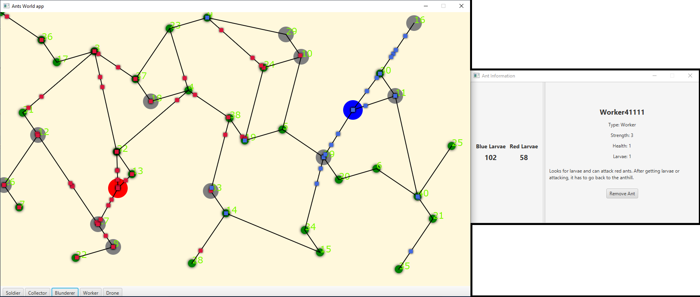

# Short Instruction
Compile the project with and run it. If the program runs correctly, you should see two windows:
1. contains the graph with some nodes and toolbar with some buttons at the bottom;
2. contains the information about the simulation.
The main window has some nodes in graph structure. Red and blue big spots are `Anthills`. The rest of the nodes are green (`Leaf`) and gray (`Stone`). To put some ants into the simulation click on the buttons at the bottom of this window. Buttons are marked with appropriate names of the ants. After clicking they start to run on the graph, spawning in according `Anthill`. They have behaviour which has been described in the requirements. 

The second window gives the information. On the left amount of larvae which is presently contained in the anthill. To see the information on the right side, we need to first click the some chosen `Ant`. Then the information will be updated according to the current ant status: how much health it has, how much larvae it carries etc. 

The information window on the right side has also a button, which allows the user to remove the Ant from the simulation.
